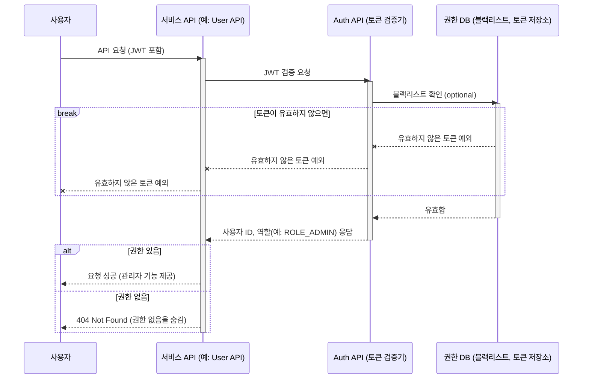

```mermaid
sequenceDiagram
    participant 사용자
    participant API as 서비스 API (예: User API)
    participant Auth as Auth API (토큰 검증기)
    participant DB as 권한 DB (블랙리스트, 토큰 저장소)

    사용자 ->> API: API 요청 (JWT 포함)
    activate API

    API ->> Auth: JWT 검증 요청
    activate Auth

    Auth ->> DB: 블랙리스트 확인 (optional)
    activate DB

    break 토큰이 유효하지 않으면
        DB --x Auth: 유효하지 않은 토큰 예외
        Auth --x API: 유효하지 않은 토큰 예외
        API --x 사용자: 유효하지 않은 토큰 예외
    end

    DB -->> Auth: 유효함
    deactivate DB

    Auth -->> API: 사용자 ID, 역할(예: ROLE_ADMIN) 응답
    deactivate Auth

    alt 권한 있음
        API -->> 사용자: 요청 성공 (관리자 기능 제공)
    else 권한 없음
        API -->> 사용자:  404 Not Found (권한 없음을 숨김)
    end
    deactivate API
```
