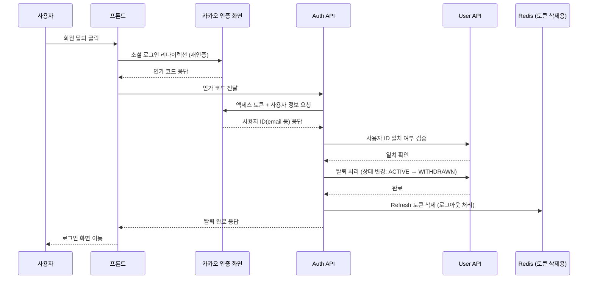

```mermaid
sequenceDiagram
    participant 사용자
    participant FE as 프론트
    participant Kakao as 카카오 인증 화면
    participant Auth as Auth API
    participant User as User API
    participant Redis as Redis (토큰 삭제용)

    사용자 ->> FE: 회원 탈퇴 클릭
    FE ->> Kakao: 소셜 로그인 리다이렉션 (재인증)
    Kakao -->> FE: 인가 코드 응답

    FE ->> Auth: 인가 코드 전달
    Auth ->> Kakao: 액세스 토큰 + 사용자 정보 요청
    Kakao -->> Auth: 사용자 ID(email 등) 응답

    Auth ->> User: 사용자 ID 일치 여부 검증
    User -->> Auth: 일치 확인

    Auth ->> User: 탈퇴 처리 (상태 변경: ACTIVE → WITHDRAWN)
    User -->> Auth: 완료

    Auth ->> Redis: Refresh 토큰 삭제 (로그아웃 처리)
    Auth -->> FE: 탈퇴 완료 응답
    FE -->> 사용자: 로그인 화면 이동
```
