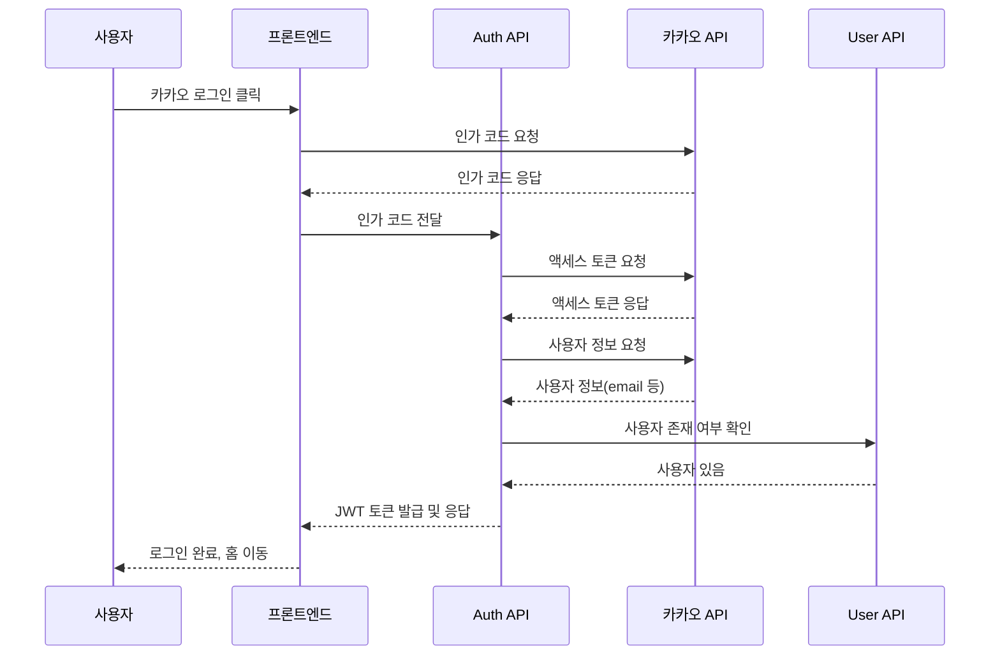

```mermaid
sequenceDiagram
    participant 사용자
    participant FE as 프론트엔드
    participant Auth as Auth API
    participant Kakao as 카카오 API
    participant User as User API

    사용자 ->> FE: 카카오 로그인 클릭
    FE ->> Kakao: 인가 코드 요청
    Kakao -->> FE: 인가 코드 응답

    FE ->> Auth: 인가 코드 전달
    Auth ->> Kakao: 액세스 토큰 요청
    Kakao -->> Auth: 액세스 토큰 응답

    Auth ->> Kakao: 사용자 정보 요청
    Kakao -->> Auth: 사용자 정보(email 등)

    Auth ->> User: 사용자 존재 여부 확인
    User -->> Auth: 사용자 있음

    Auth -->> FE: JWT 토큰 발급 및 응답
    FE -->> 사용자: 로그인 완료, 홈 이동
```
