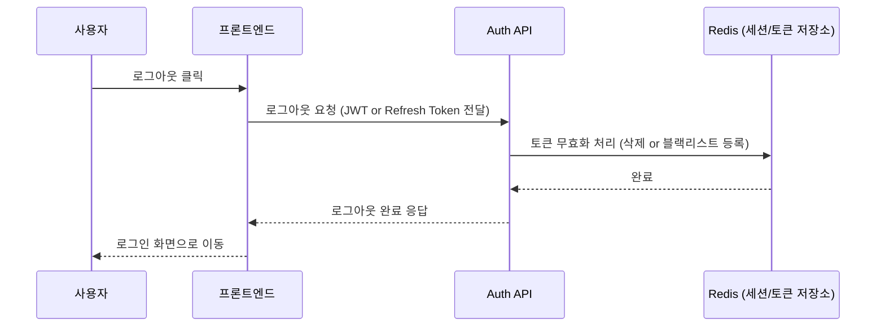

```mermaid
sequenceDiagram
    participant 사용자
    participant FE as 프론트엔드
    participant Auth as Auth API
    participant Redis as Redis (세션/토큰 저장소)

    사용자 ->> FE: 로그아웃 클릭
    FE ->> Auth: 로그아웃 요청 (JWT or Refresh Token 전달)

    Auth ->> Redis: 토큰 무효화 처리 (삭제 or 블랙리스트 등록)
    Redis -->> Auth: 완료

    Auth -->> FE: 로그아웃 완료 응답
    FE -->> 사용자: 로그인 화면으로 이동
```
