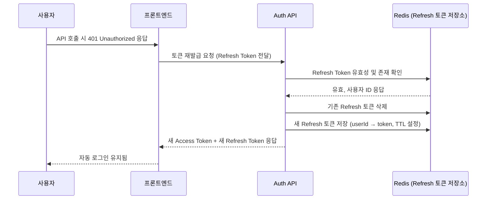
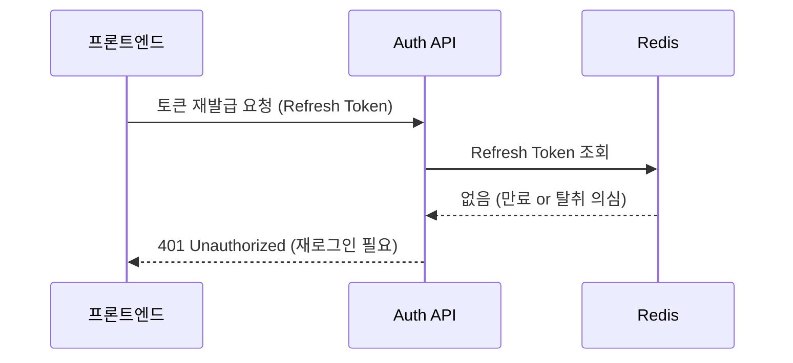

```mermaid
%% 토큰 재발급 성공
sequenceDiagram
    participant 사용자
    participant FE as 프론트엔드
    participant Auth as Auth API
    participant Redis as Redis (Refresh 토큰 저장소)

    사용자 ->> FE: API 호출 시 401 Unauthorized 응답
    FE ->> Auth: 토큰 재발급 요청 (Refresh Token 전달)

    Auth ->> Redis: Refresh Token 유효성 및 존재 확인
    Redis -->> Auth: 유효, 사용자 ID 응답

    Auth ->> Redis: 기존 Refresh 토큰 삭제
    Auth ->> Redis: 새 Refresh 토큰 저장 (userId → token, TTL 설정)

    Auth -->> FE: 새 Access Token + 새 Refresh Token 응답
    FE -->> 사용자: 자동 로그인 유지됨
```

```mermaid
%% 토큰 재발급 실패
sequenceDiagram
    participant FE as 프론트엔드
    participant Auth as Auth API
    participant Redis as Redis

    FE ->> Auth: 토큰 재발급 요청 (Refresh Token)
    Auth ->> Redis: Refresh Token 조회
    Redis -->> Auth: 없음 (만료 or 탈취 의심)

    Auth -->> FE: 401 Unauthorized (재로그인 필요)
```
