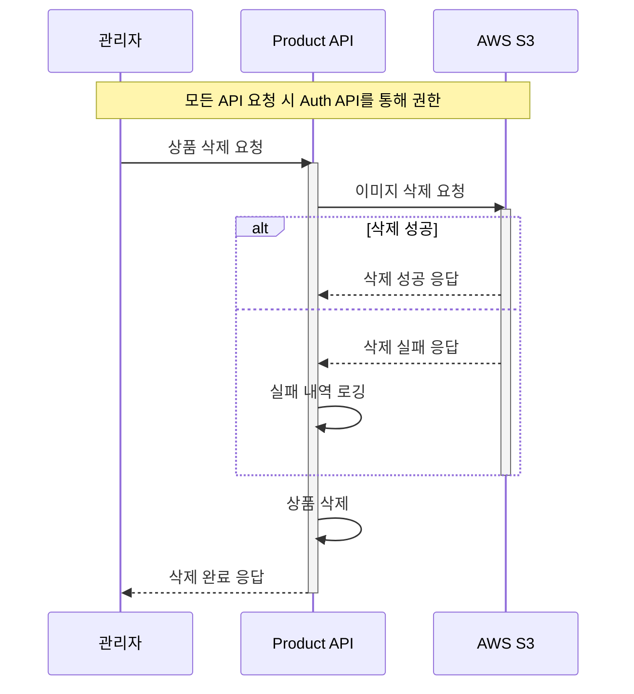

```mermaid
sequenceDiagram
    participant 관리자
    participant BE as Product API
    participant S3 as AWS S3

    note over 관리자,S3: 모든 API 요청 시 Auth API를 통해 권한 

    관리자 ->> BE: 상품 삭제 요청
    activate BE

    BE ->> S3: 이미지 삭제 요청
    activate S3
    
    alt 삭제 성공
        S3 -->> BE: 삭제 성공 응답
    else
        S3 -->> BE: 삭제 실패 응답
        BE ->> BE: 실패 내역 로깅
    end
    deactivate S3

    BE ->> BE: 상품 삭제
    BE -->> 관리자: 삭제 완료 응답
    deactivate BE
```
