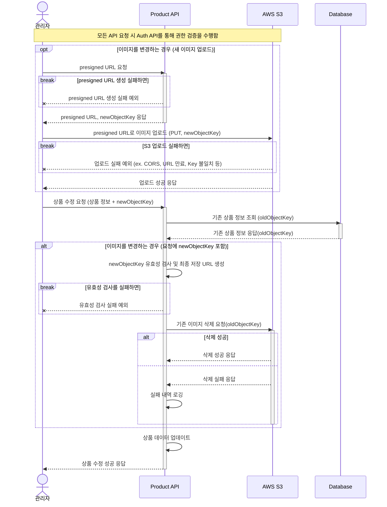

```mermaid
sequenceDiagram
    actor 관리자
    participant BE as Product API
    participant S3 as AWS S3
    participant DB as Database

    note over 관리자,S3: 모든 API 요청 시 Auth API를 통해 권한 검증을 수행함

    %% newObjectKey: 새 이미지의 Object Key
    %% oldObjectKey: 기존 이미지의 Object Key

    opt 이미지를 변경하는 경우 (새 이미지 업로드)
        %% 1. presigned URL 생성 요청
        관리자 ->> BE: presigned URL 요청
        activate BE

        break presigned URL 생성 실패하면
            BE --x 관리자: presigned URL 생성 실패 예외
        end

        BE -->> 관리자: presigned URL, newObjectKey 응답
        deactivate BE

        %% 2. S3 업로드 (새 이미지)
        관리자 ->> S3: presigned URL로 이미지 업로드 (PUT, newObjectKey)

        break S3 업로드 실패하면
            S3 --x 관리자: 업로드 실패 예외 (ex. CORS, URL 만료, Key 불일치 등)
        end
        S3 -->> 관리자: 업로드 성공 응답
    end

    %% 3. 상품 수정 요청
    관리자 ->> BE: 상품 수정 요청 (상품 정보 + newObjectKey)
    activate BE

    BE ->> DB: 기존 상품 정보 조회 (oldObjectKey)
    activate DB
    DB -->> BE: 기존 상품 정보 응답(oldObjectKey)
    deactivate DB

    alt 이미지를 변경하는 경우 (요청에 newObjectKey 포함)
        BE ->> BE: newObjectKey 유효성 검사 및 최종 저장 URL 생성
        break 유효성 검사를 실패하면
            BE --x 관리자: 유효성 검사 실패 예외
        end

        %% 고아 이미지 삭제
        BE ->> S3: 기존 이미지 삭제 요청(oldObjectKey)
        activate S3
        
        alt 삭제 성공
            S3 -->> BE: 삭제 성공 응답
        else
            S3 -->> BE: 삭제 실패 응답
            BE ->> BE: 실패 내역 로깅
        end
        deactivate S3
    end

    BE ->> BE: 상품 데이터 업데이트
    BE -->> 관리자: 상품 수정 성공 응답
    deactivate BE
```
