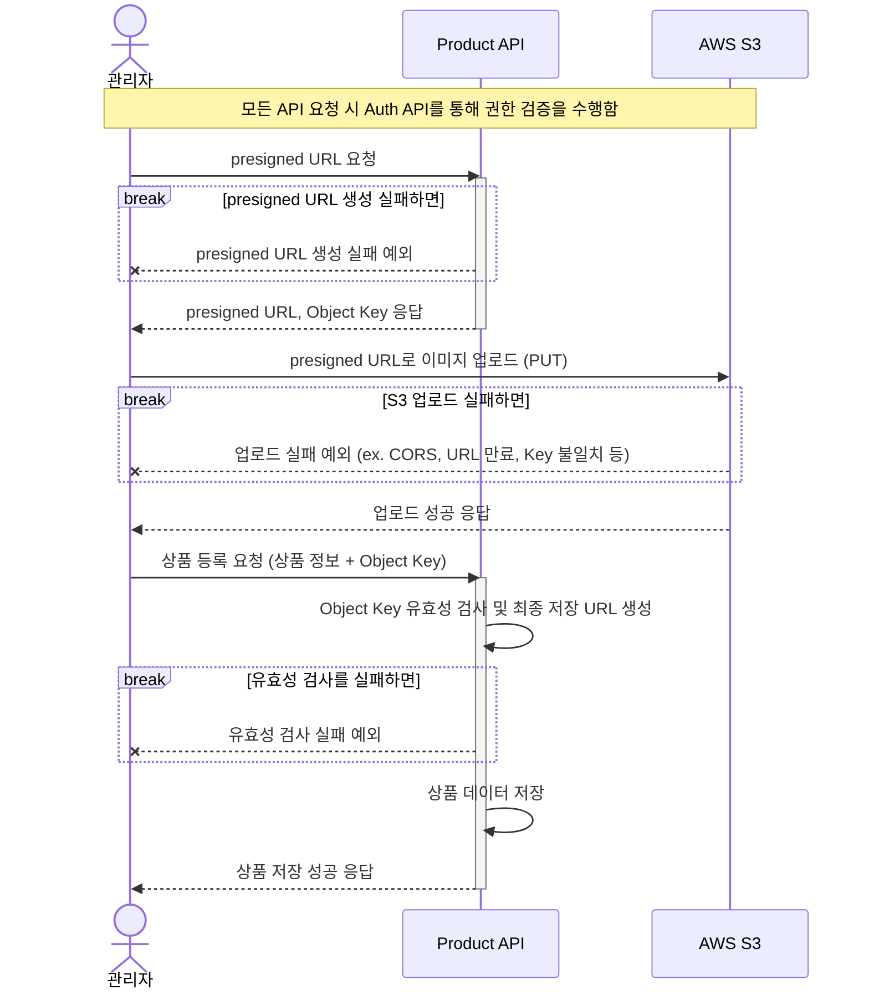

```mermaid
sequenceDiagram
    actor 관리자
    participant BE as Product API
    participant S3 as AWS S3

    note over 관리자,S3: 모든 API 요청 시 Auth API를 통해 권한 검증을 수행함

    %% 1. presigned URL 생성 요청
    관리자 ->> BE: presigned URL 요청
    activate BE

    break presigned URL 생성 실패하면
        BE --x 관리자: presigned URL 생성 실패 예외
    end

    BE -->> 관리자: presigned URL, Object Key 응답
    deactivate BE

    %% 2. S3 업로드
    관리자 ->> S3: presigned URL로 이미지 업로드 (PUT)

    break S3 업로드 실패하면
        S3 --x 관리자: 업로드 실패 예외 (ex. CORS, URL 만료, Key 불일치 등)
    end
    S3 -->> 관리자: 업로드 성공 응답

    %% 3. 상품 등록 요청
    관리자 ->> BE: 상품 등록 요청 (상품 정보 + Object Key)
    activate BE

    BE ->> BE: Object Key 유효성 검사 및 최종 저장 URL 생성
    break 유효성 검사를 실패하면
        BE --x 관리자: 유효성 검사 실패 예외
    end

    BE ->> BE: 상품 데이터 저장
    BE -->> 관리자: 상품 저장 성공 응답
    deactivate BE
```
