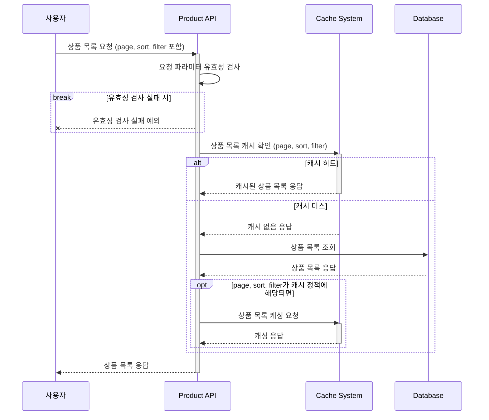

```mermaid
sequenceDiagram
    participant 사용자
    participant BE as Product API
    participant Cache as Cache System
    participant DB as Database

    사용자 ->> BE: 상품 목록 요청 (page, sort, filter 포함)
    activate BE

    BE ->> BE: 요청 파라미터 유효성 검사
    break 유효성 검사 실패 시
        BE --x 사용자: 유효성 검사 실패 예외
    end

    BE ->> Cache: 상품 목록 캐시 확인 (page, sort, filter)
    activate Cache
    
    alt 캐시 히트
        Cache -->> BE: 캐시된 상품 목록 응답
        deactivate Cache
    else 캐시 미스
        Cache -->> BE: 캐시 없음 응답

        BE ->> DB: 상품 목록 조회
        activate DB

        DB -->> BE: 상품 목록 응답
        opt page, sort, filter가 캐시 정책에 해당되면
            BE ->> Cache: 상품 목록 캐싱 요청
            activate Cache
            Cache -->> BE: 캐싱 응답
            deactivate Cache
        end
    end

    BE -->> 사용자: 상품 목록 응답
    deactivate BE
```
